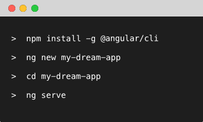

<!-- section start -->

<!-- attr: {id: 'title', class: 'slide-title', hasScriptWrapper: true} -->

# Angular CLI
## ng serve
<div class="signature">
    <p class="signature-course">Angular</p>
    <p class="signature-initiative">Telerik Software Academy</p>
    <a href="http://academy.telerik.com" class="signature-link">http://academy.telerik.com</a>
</div>

<!--  -->
<!--  -->

<!-- section start -->
<!-- attr: {id: 'table-of-contents'} -->
# Table of Contents
- Definitions
- Installation
- Usage
  - Limitations


<!-- section start -->
<!-- attr: {id: '', class: 'slide-section', showInPresentation:true, hasScriptWrapper: true} -->
<!-- # Definitions -->

<!--  -->


<!-- attr: { hasScriptWrapper:true } -->
# Angular CLI

- A command line interface for Angular
- Creating Angular projects has never been faster than with the Angular CLI
  - Create a new Angular application
  - Run a development server
  - Add features
  - Run tests
  - Build for production


<!-- attr: { hasScriptWrapper:true } -->
# Without CLI
- Configuration is a big deal breaker in Angular
  - `Create your application`
    - There are seed projects you could use
  - `Configure TypeScript`
  - `Configure Typings`
  - `Configure module bundler/loader` 
  - `Creating components, directives, pipes`


<!-- section start -->
<!-- attr: {id: '', class: 'slide-section', showInPresentation:true, hasScriptWrapper: true} -->
<!-- # Installation -->

<!--  -->

<!-- attr: { hasScriptWrapper:true } -->
# Installing

- We need [**Node.js**](https://nodejs.org/en/) and [**npm**](https://www.npmjs.com/) again

- One simple command aaand we are all done 

```
npm install -g @angular/cli
```

<!--  -->


<!-- attr: { hasScriptWrapper:true } -->
# Verify installation

- We could type 

```
ng -v
```
or

```
ng --version
```

- This will gives us information about the installed version of **Angular CLI**

<!-- section start -->
<!-- attr: {id: '', class: 'slide-section', showInPresentation:true, hasScriptWrapper: true} -->
<!-- # Usage -->

<!--  -->

<!-- attr: { hasScriptWrapper:true } -->
# Create new project

```
ng new[init] PROJECT_NAME
ng serve // in the project folder
```

- **new** vs **init** 
  - **new** creates a project in new directory
  - **init** creates a project in the current directory


<!-- attr: { hasScriptWrapper:true, style:'font-size: 0.9em'  } -->
# Generating Options

  - `--dry-run (alias d)`: Only output the files created and operations performed. It doesn't actually create the project.
  - `--verbose (alias v)`: Show more information
  - `--skip-npm`: Don't run any npm commands like installing dependencies
  - `--skip-git`: Don't create a new git repo for this project
  - `--directory`: Specify the directory you want to create this project in

<!-- attr: { hasScriptWrapper:true, style:'font-size: 0.9em'  } -->
# Generating Options

  - `--style scss`: Styles should use SASS
  - `--prefix app`: Change the default prefix for selectors
  - `--skip-test`: Don't generate spec files for testing
  - `--style scss`: Styles should use SASS
  - `--routing`: Adds routing module

<!-- attr: { hasScriptWrapper:true, style:'font-size: 0.9em'  } -->
# Lint your project

- You can lint your app code by running **ng lint**. 
- This will use the **lint** command in **package.json** file

    - `ng lint` - lint the TypeScript code
    - `ng lint --help` - show the help 
    - `ng lint --fix` - fixes automatically errors

- Use **tslint.json** to configure linter for your project

<!-- attr: { hasScriptWrapper:true } -->
# Serve your project
- You can tweak your server with port and host by your choice

```
ng serve
ng serve --host 0.0.0.0
ng serve --port 4201
ng serve --host 0.0.0.0 --port 4201
```

<!-- attr: { hasScriptWrapper:true } -->
# Blueprints

- You can use **ng generate** (**ng g**) to generate components(or any other building block of Angular)


- Components support relative path generation
  
- If in the directory **src/app/feature/** and you run

  ```
  ng g component new-cmp
  ```

- Your component will be generated in **src/app/feature/new-cmp**

<!-- attr: { hasScriptWrapper:true } -->
# Blueprints

- But if you were to run
  
```
ng g component ../newer-cmp
```

- Your component will be generated in **src/app/newer-cmp**

<!-- attr: { hasScriptWrapper:true } -->
# Blueprint Options

- `--flat true|false` - folder creation
- `--inline-template true|false` - inline template in the component
- `--inline-style true|false` - inline style in the component
- `--spec true|false` - generate spec file for tests


<!-- attr: { hasScriptWrapper:true, style:'font-size: 0.9em' } -->
# Blueprints


| **Scaffold**  |	**Usage**               |
| :-----------: | :---------------------: |
| Component     |	ng g c my-new-component |
| Directive     |	ng g d my-new-directive |
| Pipe          |	ng g p my-new-pipe      |
| Service       |	ng g s my-new-service   |
| Interface     |	ng g i my-new-interface |
| Class         |	ng g c my-new-class     |
| Enum          |	ng g e my-new-enum      |
| Module        |	ng g m my-module        |


<!-- attr: { hasScriptWrapper:true } -->
# Build 

- Build targets in the **angular-cli.json** file
  - The default is **dev**

```
"environments": {
    "source": "environments/environment.ts",
    "dev": "environments/environment.ts",
    "prod": "environments/environment.prod.ts"
}
```

<!-- attr: { hasScriptWrapper:true } -->
# Build 

- These are equivalent
  - The environment and target could be changed

  ```
  ng build --target=production --environment=prod
  ng build --prod --env=prod
  ng build --prod
  ```

<!-- attr: { hasScriptWrapper:true } -->
# Environments

- All builds make use of bundling, and using the `--prod` flag in <br/> `ng build --prod` or `ng serve --prod` <br/> will also make use of **uglifying and tree-shaking** functionality.
  - You can use [source-map-explorer](https://github.com/danvk/source-map-explorer) to view and explore different builds 

<!-- attr: { hasScriptWrapper:true, style:'font-size: 0.85em' } -->
# Environments

|   | ng build | ng build --prod |
|:--:|:---:|:---:|
| `Source maps` | _generated_ | _not generated_ |
| `Extracted CSS` | _global CSS output to .js_ | _yes, to  css files_ |
| `Uglifying` | _no_ | _no_ |
| `Tree-Shaking` | _no_ | _yes_ |
| `AOT` | _no_ | _yes_ |

<!-- attr: { hasScriptWrapper:true } -->
# Tree-Shaking

- **What is Tree-Shaking?** 
  - Tree-Shaking is the ability to remove any code that we are not actually using in our application from the final bundle. It's one of the most effective techniques to reduce the footprint of an application.

[http://blog.rangle.io/optimize-your-angular2-application-with-tree-shaking/](http://blog.rangle.io/optimize-your-angular2-application-with-tree-shaking/)


<!-- attr: { hasScriptWrapper:true } -->
# Testing the application

- Unit Testing
  - Tests will execute after a build is executed via Karma, and it will automatically watch your files for changes

  ```
  ng test
  ```

<!-- attr: { hasScriptWrapper:true } -->
# Testing the application

- End-to-End Testing
  - Before running the tests make sure you are serving the app via ng serve

  ```
  ng e2e
  ```


<!-- attr: { hasScriptWrapper:true } -->
# Assets

- You use the assets array in **angular-cli.json** to list files or folders you want to **copy as-is** when building your project
```
"assets": [
  "assets",
  "favicon.ico"
]
```

<!-- attr: { hasScriptWrapper:true} -->
# Global Styles

- The **styles.css** file allows users to add global styles and supports CSS imports
- If the project is created with the **--style=sass** option, this will be a **.sass** file instead, and the same applies to **scss/less/styl**
- You can add more global styles via the **apps[0].styles** property in **angular-cli.json** file

<!-- attr: { hasScriptWrapper:true } -->
# Styles Extensions

- When generating a new project you can also define which extension you want for style files

  ```
  - ng new my-project --style=sass
  ```

- Or set the default style on an existing project

  ```
  ng set defaults.styleExt scss
  ```

<!-- attr: { hasScriptWrapper:true} -->
# 3rd Party Libraries

- Simply install your library via 

```
npm install lib-name --save
```

- Then just use **import** in your code


<!-- attr: { hasScriptWrapper:true, style:'font-size: 0.8em' } -->
# Global Libraries

- Some javascript libraries need to be added to the global scope

```
npm install bootstrap@next
```

- Scripts

```
"scripts": [
  "../node_modules/jquery/dist/jquery.js",
  "../node_modules/tether/dist/js/tether.js",
  "../node_modules/bootstrap/dist/js/bootstrap.js"
]
```

- Styles

```
"styles": [
  "../node_modules/bootstrap/dist/css/bootstrap.css",
  "styles.css"
]
```

<!-- section start -->
<!-- attr: {id: '', class: 'slide-section', showInPresentation:true, hasScriptWrapper: true} -->
<!-- # Architecture Overview -->


<!-- attr: { hasScriptWrapper:true} -->
# Architecture
- This is the architecture of a<br/> typical Angular CLI project
- There are a few files which<br /> need your attention
  - **tsconfig.json**
  - **tslint.json**
  - **.angular-cli.json**


<!--  -->


<!-- attr: {id: '', class: 'slide-section', showInPresentation:true, hasScriptWrapper: true} -->
<!-- # Limitations -->

<!--  -->


<!-- attr: { hasScriptWrapper:true} -->
# CLI Limitations (for now)

- No support for add-ons 
- No support for custom Webpack config
- Sorry but we will not expose the webpack confit for various reasons...
  - 12 Aug 2016

[https://github.com/angular/angular-cli/issues/1656#issuecomment-239366723](https://github.com/angular/angular-cli/issues/1656#issuecomment-239366723)

[https://github.com/angular/angular-cli/issues/1656#issuecomment-240171375](https://github.com/angular/angular-cli/issues/1656#issuecomment-240171375)

<!-- attr: { hasScriptWrapper:true} -->
# CLI Limitations (for now)

- Regardless we are taking our time on this to ensure that we give you a solution that works for everyone the right way
  - 30 Aug 2016

[https://github.com/angular/angular-cli/issues/1656#issuecomment-243433697](https://github.com/angular/angular-cli/issues/1656#issuecomment-243433697)


<!-- section start -->
<!-- attr: {id: 'questions', class: 'slide-section', hasScriptWrapper:true} -->

# Questions
<!--  -->


<!-- attr: { showInPresentation: true, hasScriptWrapper: true} -->
# Free Training @ Telerik Academy

- Angular Course
  - [Angular](http://academy.telerik.com/student-courses/web-design-and-ui/spa-applications-with-angular2/about)
- Telerik Software Academy
  - [telerikacademy.com](https://telerikacademy.com)
- Telerik Academy @ Facebook
  - [facebook.com/TelerikAcademy](https://facebook.com/TelerikAcademy)
- Telerik Academy Learning System
  - [telerikacademy.com](https://telerikacademy.com)
