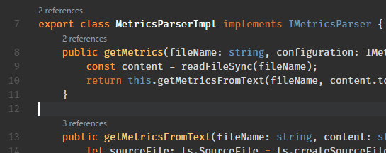
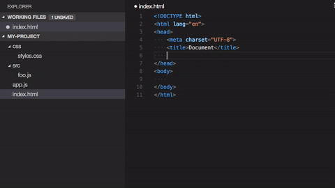
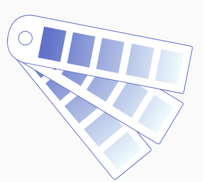

<!-- section start -->

<!-- attr: {id: 'title', class: 'slide-title', hasScriptWrapper: true} -->

# Angular Tools
## Boost your Angular performance
<div class="signature">
    <p class="signature-course">Angular</p>
    <p class="signature-initiative">Telerik Software Academy</p>
    <a href="http://academy.telerik.com" class="signature-link">http://academy.telerik.com</a>
</div>

<!--  -->
<!--  -->

<!-- section start -->
<!-- attr: {id: 'table-of-contents'} -->
# Table of Contents
- IDEs
  - Visual Studio Code Tools
- Angular Tools


<!-- section start -->
<!-- attr: {id: '', class: 'slide-section', showInPresentation:true, hasScriptWrapper: true} -->
<!-- # IDEs -->

<!--  -->
<!--  -->
<!--  -->


<!-- attr: { hasScriptWrapper:true } -->
# IDEs

- You could use any time of IDE or text editor
  - It is a personal choice
  - But some of them are more enhanced for working with Angular and TypeScript
- Most popular
  - [Visual Studio Code](https://code.visualstudio.com/)
  - [WebStorm](https://www.jetbrains.com/webstorm/)
  - [IntelliJ IDEA](https://www.jetbrains.com/idea/)

<!-- attr: {id: '', class: 'slide-section', showInPresentation:true, hasScriptWrapper: true} -->
<!-- # Visual Studio Code Tools -->
<!--  -->
<!--  -->


<!-- attr: { hasScriptWrapper:true } -->
# VS Code Tools

- `Angular Language Service`
  - [https://github.com/angular/vscode-ng-language-service](https://github.com/angular/vscode-ng-language-service)
  - Provides completion in template files
  - if not working please exclude node_modules in VS Code

<div class="fragment">     
<!--  -->
</div>

<!-- attr: { hasScriptWrapper:true } -->
# VS Code Tools

- `TSLint`
  - [https://github.com/Microsoft/vscode-tslint](https://github.com/Microsoft/vscode-tslint)
  - Integrates the `tslint` linter for the TypeScript language into VS Code.
  - The extension supports automatic fixing of warnings to the extent supported by tslint

<!-- attr: { hasScriptWrapper:true } -->
# VS Code Tools

- `Angular Snippets`
  - There are a few extensions
    - [https://github.com/BeastCode/VSCode-Angular-TypeScript-Snippets](https://github.com/BeastCode/VSCode-Angular-TypeScript-Snippets)
    - [https://github.com/johnpapa/vscode-angular-snippets](https://github.com/johnpapa/vscode-angular-snippets)

<div class="fragment">     
<!--  -->
</div>
<div class="fragment">     
<!--  -->
</div>

<!-- attr: { hasScriptWrapper:true } -->
# VS Code Tools

- `Angular Files`
  - [https://github.com/qwert789/vscode-angular2-files](https://github.com/qwert789/vscode-angular2-files)
  - This extension allows quickly scaffold `Angular` file templates in `VS Code` project

```
"defaults": {
        "styleExt": "css",
        "component": {
            "spec": true,
            "inlineStyle": false,
            "inlineTemplate": false,
            "flat": false
        },
```
<div class="fragment">     
<!--  -->
</div>

<!-- attr: { hasScriptWrapper:true } -->
# VS Code Tools

- `Type Lens`
  - [https://github.com/kisstkondoros/typelens](https://github.com/kisstkondoros/typelens)
  - A `VS Code` plugin which adds reference counter code lenses to `typescript`, `javascript`, `scss` and `less` files


<div class="fragment">     
<!--  -->
</div>

<!-- attr: { hasScriptWrapper:true } -->
# VS Code Tools

- `Types Auto Installer`
  - [https://github.com/jvitor83/typings-autoinstaller](https://github.com/jvitor83/typings-autoinstaller)
  - Any time you save either `package.json` or `bower.json` the [typings](https://github.com/DefinitelyTyped/DefinitelyTyped) packages will be installed/uninstalled automatically in the background

<div class="balloon fragment" style="left:10%">When you install a package
<br/>

```
npm install --save lodash
```
<br/>
This plugin automatically run this command
<br/>
```
npm install --save @types/lodash
```
</div>

<!-- attr: { hasScriptWrapper:true } -->
# VS Code Tools

- `Angular Switcher`
  - [https://github.com/infinity1207/angular2-switcher](https://github.com/infinity1207/angular2-switcher)
  - Easily navigate to `typescript(.ts)`, `template(.html)`, `style(.scss/.sass/.less/.css)` in Angular project.


<!-- attr: { hasScriptWrapper:true } -->
# VS Code Tools

- `Auto Import`
  - [https://github.com/soates/Auto-Import](https://github.com/soates/Auto-Import)
  - Automatically finds, parses and provides code actions for all available imports. Only currently works with files in your folder and TypeScript


<div class="fragment">     
<!--  -->
</div>

<!-- attr: { hasScriptWrapper:true } -->
# VS Code Tools

- `Path Intellisense`
  - [https://github.com/ChristianKohler/PathIntellisense](https://github.com/ChristianKohler/PathIntellisense)
  - `Visual Studio Code` plugin that autocompletes filenames


<div class="fragment">     
<!--  -->
</div>

<!-- section start -->
<!-- attr: {id: '', class: 'slide-section', showInPresentation:true, hasScriptWrapper: true} -->
<!-- # Angular Tools -->

<!--  -->
<!--  -->


<!-- attr: { hasScriptWrapper:true } -->
# Angular Tools

- `Angular CLI`
  - [https://cli.angular.io/](https://cli.angular.io/)
  - A command line interface for Angular
  - Easily generate whole application as well as all the needed building blocks

<!--  -->


<!-- attr: { hasScriptWrapper:true } -->
# Angular Tools

- `Augury`
  - [https://augury.angular.io/](https://augury.angular.io/)
  - Google Chrome Extension for debugging and profiling Angular applications
  - Open source and supported by Google and [Rangle.io](https://rangle.io/)
  - You can Augury in Chrome developer tools (`F12`)

<!--  -->


<!-- attr: { hasScriptWrapper:true } -->
# Angular Tools

- `Codelyzer`
  - [http://codelyzer.com/](http://codelyzer.com/)
  - [https://github.com/mgechev/codelyzer](https://github.com/mgechev/codelyzer)
  - A set of `tslint` rules for static code analysis of `Angular TypeScript` projects
  - `Angular CLI` has support for `Codelyzer`

<!--  -->
  

<!-- attr: { hasScriptWrapper:true } -->
# Angular Tools

- `Compodoc`
  - [https://compodoc.github.io/website/](https://compodoc.github.io/website/)
    - [Live demo](https://compodoc.github.io/compodoc-demo-todomvc-angular/)
  - Documentation tool for Angular applications

<!--  -->
  
<!-- attr: { hasScriptWrapper:true } -->
# Angular Tools

- `Angular Material`
  - [https://material.angular.io/](https://material.angular.io/)
  - Material Design components for Angular
- Material Design
  - [https://material.io/guidelines/material-design/introduction.html](https://material.io/guidelines/material-design/introduction.html)

<!--  -->
  

<!-- attr: { hasScriptWrapper:true } -->
# Angular Resources

- You can find many useful resources on the official Angular website
  - [https://angular.io/resources](https://angular.io/resources)
- List of many components which are ready to use and could be useful even for learning purposes if not used in your application
  - [https://github.com/brillout/awesome-angular-components](https://github.com/brillout/awesome-angular-components)


<!-- section start -->
<!-- attr: {id: 'questions', class: 'slide-section', hasScriptWrapper:true} -->

# Questions
<!--  -->


<!-- attr: { showInPresentation: true, hasScriptWrapper: true} -->
# Free Training @ Telerik Academy

- Angular Course
  - [Angular](http://academy.telerik.com/student-courses/web-design-and-ui/spa-applications-with-angular2/about)
- Telerik Software Academy
  - [telerikacademy.com](https://telerikacademy.com)
- Telerik Academy @ Facebook
  - [facebook.com/TelerikAcademy](https://facebook.com/TelerikAcademy)
- Telerik Academy Learning System
  - [telerikacademy.com](https://telerikacademy.com)
