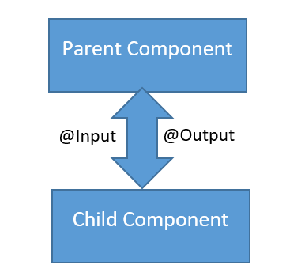

<!-- section start -->

<!-- attr: {id: 'title', class: 'slide-title', hasScriptWrapper: true} -->

# Angular Components
## Advanced
<div class="signature">
    <p class="signature-course">Angular</p>
    <p class="signature-initiative">Telerik Software Academy</p>
    <a href="http://academy.telerik.com" class="signature-link">http://academy.telerik.com</a>
</div>

<!--  -->

<!-- section start -->
<!-- attr: {id: 'table-of-contents'} -->
# Table of Contents
- Component Communication
  - Local variable
  - Input
  - Output
  - ViewChild
- Mastering Components
  - ContentChild
  - ElementRef
  - Renderer2

<!-- section start -->
<!-- attr: {id: '', class: 'slide-section', showInPresentation:true, hasScriptWrapper: true} -->
<!-- # Component Communication  -->

<!--  -->

<!-- attr: {id: '', class: 'slide-section', showInPresentation:true, hasScriptWrapper: true} -->
<!-- # Reference variable  -->

<!-- attr: { hasScriptWrapper:true } -->
# Template reference variables

- Reference to the DOM element
   - or reference to Angular component
- Declared with `#` 

```
<input #inp type="text">
<button (click)="someMethod(inp)">Add</button>
```

- Could be used `anywhere` in the template

<!-- attr: { hasScriptWrapper:true } -->
# Parent call child with `#`

- A `parent` component `cannot` use data binding to read child properties or invoke child methods
  - You can do both by creating a `template reference variable` for the child element
  - Then reference that variable within the parent template

```
<app-child #child></app-child>
<button (click)="child.callSomeMethod()"></button>
```


<!-- attr: { hasScriptWrapper:true } -->
# Template reference variables

- The scope of a reference variable is the entire template
- Do not define the same variable name more than once in the same template
- You can use the `ref-` prefix alternative to `#`

```
<input ref-inp type="text">
<button (click)="someMethod(inp)">Add</button>
```


<!-- attr: {id: '', class: 'slide-section', showInPresentation:true, hasScriptWrapper: true} -->
<!-- # @Input()  -->

<!-- attr: { hasScriptWrapper:true } -->
# Input

- Pass data from `parent to child` with input binding
- `Input` properties usually receive data values

```
// child.component.ts
@Input()
text;

// parent.component.html
<child [text]="someValue"></child>
```

<!-- attr: { hasScriptWrapper:true, style:'font-size: 0.9em' } -->
# Input setter

- You could use an `input` property setter 
  - To intercept and act upon a value from the parent
  - If a value passed by the parent is not valid you could set a default value

```
private _number;
@Input() set number(val) {
  const num = Number(val);
  if (!num) {
    this._number = 'Not a number passed!';
  }else{
    this._number = num;
  }
}
get number() {
  return this._number;
}
```

<!-- attr: {id: '', class: 'slide-section', showInPresentation:true, hasScriptWrapper: true} -->
<!-- # @Output()  -->

<!-- attr: { hasScriptWrapper:true } -->
# Output

- `Child` component exposes an `EventEmitter`
  - Emits events when something happens
- The `parent` binds to that event property and `reacts to those events`
- The child's `EventEmitter` property is an `output` property

<!-- attr: { hasScriptWrapper:true } -->
# Output

```
// child.component.ts
@Output()
childEvent = new EventEmitter<T>();

action(){
  this.childEvent.emit('someValue|object')
}

// child.component.html
<button (click)="action()">Emit event</button>

// parent.component.html
<child (childEvent)="someAction()"></child>

// parent.component.ts
someAction(){
  console.log('Event called from child pops up here')
}
```

<!-- attr: {id: '', class: 'slide-section', showInPresentation:true, hasScriptWrapper: true} -->
<!-- # @ViewChild()  -->

<!-- attr: { hasScriptWrapper:true } -->
# ViewChild

- The `local variable` approach is simple and easy
  - But `limited` because the parent-child wiring must be done `entirely within the parent template`
- When the `parent component` class requires access to childs, `inject` the child component into the parent as a `ViewChild`

<!-- attr: { hasScriptWrapper:true } -->
# ViewChild

- To get access to a component and its methods, we can use the `@ViewChild` decorator (returns the first found)
  - `@ViewChildren` will return a collection (`QueryList`) of all the found children

```
// parent.component.ts
@ViewChild(ChildComponent)
private childComponent;

// parent.component.html
<div>Sample html could be placed</div>
<child></child>
```

<!-- attr: { hasScriptWrapper:true } -->
# ViewChild

- `@ViewChild` could be used with a type of the child component

```
@ViewChild(ChildComponent)
private childComponent;
```

- Or with a local variable 

```
// parent.component.ts
@ViewChild('c')
private childComponent;

// parent.component.html
<child #c></child>
```


<!-- section start -->
<!-- attr: {id: '', class: 'slide-section', showInPresentation:true, hasScriptWrapper: true} -->
<!-- # Mastering Components  -->

<!--  -->

<!-- attr: {id: '', class: 'slide-section', showInPresentation:true, hasScriptWrapper: true} -->
<!-- # @ContentChild()  -->

<!-- attr: { hasScriptWrapper:true } -->
# Content child

- `@ContentChild` includes only elements that exists within the `ng-content` tag

```
// child.component.ts
@ContentChild(AnotherComponent)
private anotherComponent;

// child.component.html
<child><another></another></child>
```

<!-- attr: { hasScriptWrapper:true } -->
# Content child

- Or with a local variable 

```
// child.component.ts
@ContentChild('c')
private childComponentDiv;

// child.component.html
<child><div #c></div></child>
```

- `@ContentChildren` returns a collection (`QueryList`) of elements

<!-- attr: { hasScriptWrapper:true } -->
# Content child

- `@ViewChild` could be used with a type of the child component

```
// parent.component.ts
@ContentChild('c')
private childComponentDiv;

// parent.component.html
<child><div #c></div></child>
```

<!-- attr: {id: '', class: 'slide-section', showInPresentation:true, hasScriptWrapper: true} -->
<!-- # ElementRef  -->

<!-- attr: { hasScriptWrapper:true } -->
# ElementRef

<div style="background-color:#990000; color: white; border-radius: 10px; padding: 10px; font-weight: bold"> Use templating and data-binding provided by Angular instead!!!</div>
- Provides access to the underlying native element (DOM element)
  - `Use with caution!`
  - [https://angular.io/api/core/ElementRef](https://angular.io/api/core/ElementRef)

```
constructor(private elementRef: ElementRef) { }
```

- Gives us a reference to the element

<!-- attr: {id: '', class: 'slide-section', showInPresentation:true, hasScriptWrapper: true} -->
<!-- # Renderer2  -->

<!-- attr: { hasScriptWrapper:true } -->
# Renderer2

- **Use the Renderer2 instead** (**21 Aug 2017**)
  - The Renderer class is a built-in service that provides an abstraction for `UI rendering manipulations`

- You can use `@ViewChild` and get the `nativeElement`

```
@ViewChild("input") input;
  
ngAfterContentInit() {
  this.input.nativeElement.focus();
}
```

<!-- attr: { hasScriptWrapper:true } -->
# Renderer2

- The problem with `@ViewChild nativeElement`?
  - not be able to use it in non-DOM environments
  - Angular is multi-platform

- So what you do is to give this responsibility to the Renderer class


<!-- attr: { hasScriptWrapper:true } -->
# Renderer2

```
constructor(
  private elementRef: ElementRef,
  private renderer: Renderer2) { }

ngOnInit() {
  const h1 = this.renderer.createElement('h1');
  this.renderer
      .setProperty(h1, 'innerHTML', 'Added h1 by Renderer2');
  this.renderer
      .appendChild(this.elementRef.nativeElement, h1);
}
```
- Notice how we also use `ElementRef` to get access to the underlining native element


<!-- section start -->
<!-- attr: {  hasScriptWrapper:true } -->
# Questions

<!--  -->


<!-- attr: { showInPresentation: true, hasScriptWrapper: true} -->
# Free Training @ Telerik Academy

- Angular Course
  - [Angular](http://academy.telerik.com/student-courses/web-design-and-ui/spa-applications-with-angular/about)
- Telerik Software Academy
  - [telerikacademy.com](https://telerikacademy.com)
- Telerik Academy @ Facebook
  - [facebook.com/TelerikAcademy](https://facebook.com/TelerikAcademy)
- Telerik Academy Learning System
  - [telerikacademy.com](https://telerikacademy.com)
