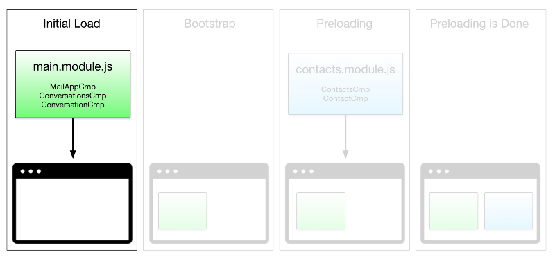
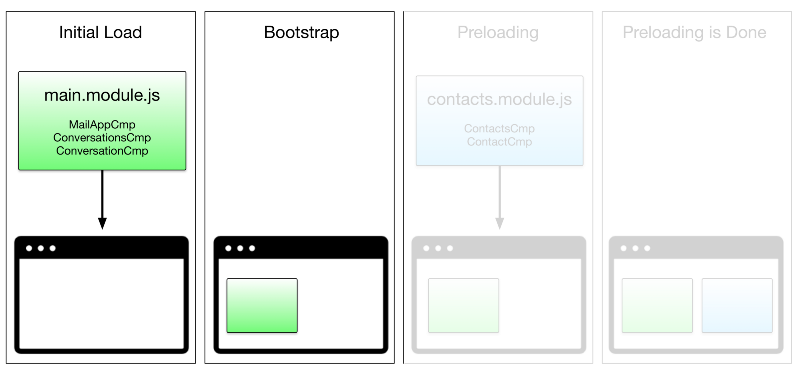
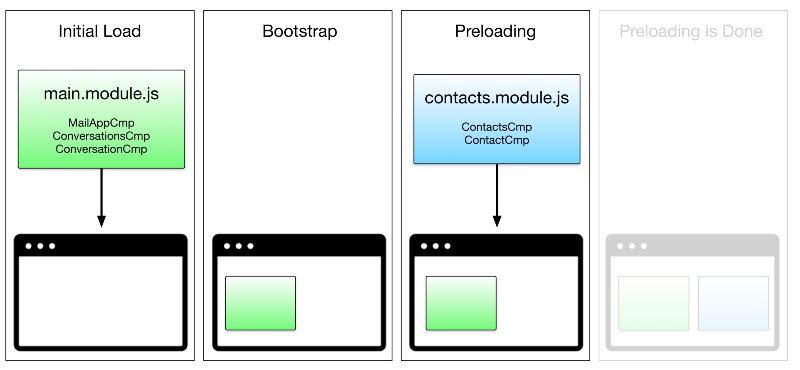
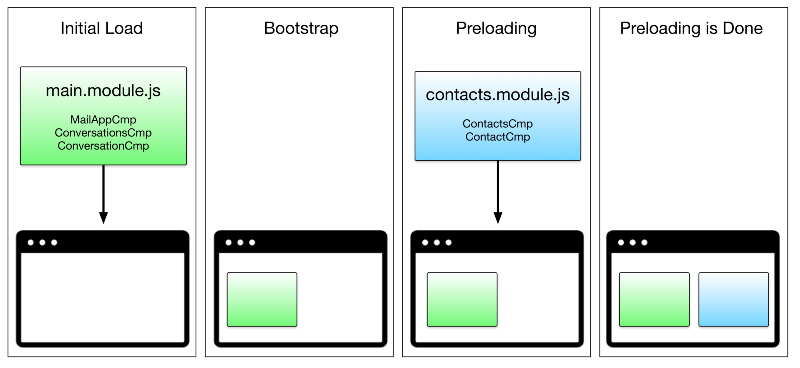

<!-- section start -->

<!-- attr: {id: 'title', class: 'slide-title', hasScriptWrapper: true} -->
# Angular Router
## Navigate in the application

<div class="signature">
    <p class="signature-course">Angular</p>
    <p class="signature-initiative">Telerik Software Academy</p>
    <a href="http://academy.telerik.com" class="signature-link">http://academy.telerik.com</a>
</div>

<!--  -->


<!-- section start -->

# Table of Contents

- What is router?
- Route Guards
- Lazy loaded modules

<!-- section start -->

<!-- attr: {class:"slide-section"} -->
# What is router?

<!-- attr: {hasScriptWrapper: true} -->
# What is routing?

- Routing the standard way to navigate in a web applications
  - The user enter a URL in the address bar in the browser and different content is shown
    - i.e. different pages
- Each unique route must always return the same page

<!-- attr: {hasScriptWrapper: true} -->
# What is routing?
- Routes can have route and query parameters
  - Route parameters are part of the URL
    - ID, name, etc...
  - Route parameters can be different and serve as kind of meta data
    - Sort criteria
    - Page number
    - Filter criteria

<!-- slide section -->

<!-- attr: {class:"slide-section"} -->
# Router

<!-- attr: {hasScriptWrapper: true} -->

# Router

- `Angular Router` is a separate package `@angular/router`
      - not part of the official `@angular/core`
  - Supports multiple routes, route parameters, query parameters, regex routes, etc...
- How does it work?
    - Just register a mapping between a URL and a `Component`

<!-- attr: {hasScriptWrapper: true} -->
# Configuration Router

- Set `<base href="/">` in the `<head>` of the `index.html`
- Create routes
  - An array of `{path: string, component: Component, ... }` objects

```ts
{ path: 'home', component: HomeComponent },
{
  path: 'users',
  loadChildren: './users/users.module#UsersModule',
  resolve: {
     'users': UsersListResolver
  }
},
{ path: '**', component: NotFoundComponent },
```

<!-- attr: {hasScriptWrapper: true} -->
# Configuration Router
- Register `RouterModule` in `imports`:
  - The routes registered in the `AppModule`

  ```js
  @NgModule({
    imports: [..., RouterModule.forRoot(routes , {options: options}?) ,...]
  })
  ```

- Place a `<router-outlet>` in a component
  - This is the placeholder for the different pages


<!-- attr: {hasScriptWrapper: true} -->
# Angular Routes

- The router supports `route` and `query` parameters
  - Route parameters are defined using `ROUTE_URL/:id` syntax
  - Query parameters are not defined explicitly
- How the route will be reached only if `id` is provided

<!-- attr: {hasScriptWrapper: true} -->
# Angular Routes
- How to handle route parameters?
  - Inject `ActivatedRoute` into the costructor of the `@Component`
  - `route.params` returns an object with the route parameters
  - `route.queryParams` returns an object with the query params


<!-- section start -->

<!-- attr: {class: 'slide-section'} -->
# Route Guards

<!-- attr: {hasScriptWrapper: true} -->
# Route Guards

- Routes in the Angular Router can have **one or many guards**
  - i.e. operations that can be executed before the actual route is reached
  - Can be used to limit the access to certain routes, load data before hand, etc...

<!-- attr: {hasScriptWrapper: true} -->
# Route Guards
- The route guards are:
  - `CanActivate` to mediate navigation to a route
  - `CanActivateChild` to mediate navigation to a child route
  - `CanDeactivate` to mediate navigation away from the current route
  - `Resolve` to perform route data retrieval before route activation
  - `CanLoad` to mediate navigation to a feature module loaded asynchronously

<!-- attr: {hasScriptWrapper: true} -->
# How to use Route Guards?

- To use route guards just create a class that implements one of the guards:
  - or just a function which resolves to boolean

  ```js
  @Injectable()
  export class AuthGuard implements CanActivate {
    canActivate(){
      // return true if the route is reachable
      // return false if the route is not reachable
    }
  }
  ```

<!-- attr: {hasScriptWrapper: true} -->
# How to use Route Guards?

- Then add the guard to the route registration:

  ```js
  const routes: Routes = [{
      path: 'profile',
      component: ProfileComponent,
      canActivate: AuthGuard
  }]
  ```
<!-- section start -->
  <!-- attr: {class:'slide-section',hasScriptWrapper: true} -->
# Lazy loading

<!-- attr: {hasScriptWrapper: true} -->
# Lazy loading

- The root route definition is set on the `app-routing.module.ts` module

```ts
// app.routing-module.ts
export const ROUTES: Routes = [
  { path: '',      component: HomeComponent },
  { path: 'home',  component: HomeComponent },
  { path: 'about', component: AboutComponent },
  { path: 'detail', loadChildren: './detail#DetailModule'},
  { path: '**',    component: NoContentComponent },
];
```

<!-- attr: {hasScriptWrapper: true} -->
# Lazy loading

- `loadChildren` property lazy loads our child routes
  - `DetailModule` is lazy loaded
- The term lazy loaded is not a guarantee for `asynchrony`
- Register the module in the Angular application **only when the route hits**

<!-- attr: {hasScriptWrapper: true} -->
# Lazy loading
- There's a few important things to notice
  - We use the property `loadChildren` instead of `component`
  - We pass a string instead of a symbol to avoid loading the module eagerly
  - We define `not only the path` to the module but `the name of the class` as well

<!-- attr: {hasScriptWrapper: true} -->
# Lazy loading

- Notice that we use the method call `forChild` instead of `forRoot` to create the routing object.
- We should always do that when creating a routing object for a feature module, no matter if the module is supposed to be eagerly or lazily loaded

<!-- attr: {hasScriptWrapper: true} -->
# Preloading strategy

- `Angular` provides a **preloading strategy** that `preloads all modules` as quickly as possible
- Lazy loading speeds up our application load time by splitting it into multiple bundles, and loading them on demand
  - When the user navigates to the lazy-loadable section of the application, the router will have to fetch the required modules from the server

<!-- attr: {hasScriptWrapper: true} -->
# Preloading strategy

- The router can `preload lazy-loadable modules` in the background while the user is interacting with our application


<!-- attr: {hasScriptWrapper: true} -->
# Preloading strategy

- First, we load the initial bundle, which contains only the components we have to have to bootstrap our application

<!--  -->

<!-- attr: {hasScriptWrapper: true} -->
# Preloading strategy

- Then, we bootstrap the application using this small bundle

<!--  -->

<!-- attr: {hasScriptWrapper: true} -->
# Preloading strategy

- While the app is working, we, in the background, preload other modules

<!--  -->


<!-- attr: {hasScriptWrapper: true} -->
# Preloading strategy

- Finally, when users clicks on a link going to a lazy-loadable module, the navigation is instant

<!--  -->

<!-- section start -->
<!-- attr: {hasScriptWrapper: true} -->

# Questions
<!--  -->


<!-- attr: { showInPresentation: true, hasScriptWrapper: true} -->
# Free Training @ Telerik Academy

- Angular Course
  - [Angular](http://academy.telerik.com/student-courses/web-design-and-ui/spa-applications-with-angular/about)
- Telerik Software Academy
  - [telerikacademy.com](https://telerikacademy.com)
- Telerik Academy @ Facebook
  - [facebook.com/TelerikAcademy](https://facebook.com/TelerikAcademy)
- Telerik Academy Learning System
  - [telerikacademy.com](https://telerikacademy.com)
